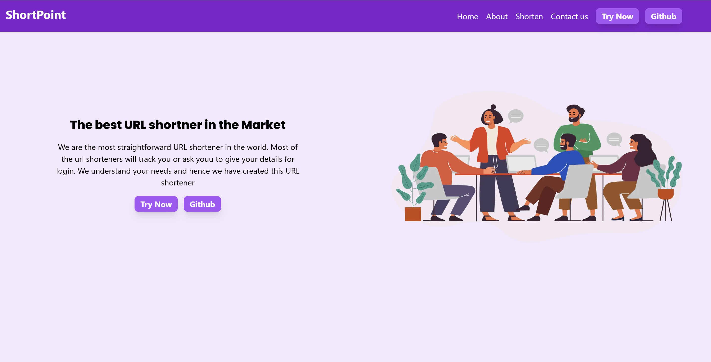

# 🔗 ShortPoint

ShortPoint is a URL shortening web application built using Next.js, Tailwind CSS, and MongoDB. It allows users to shorten long URLs, track usage, and manage shortened links efficiently.

## 🚀 Features

- ✂️ Shorten long URLs instantly
- 🔗 Generate custom short links
- 🔒 Secure and unique URL generation
- 🎨 Responsive UI with Tailwind CSS

## 🛠️ Tech Stack

- **Frontend:** Next.js, Tailwind CSS
- **Backend:** Next.js API Routes, MongoDB
- **Database:** MongoDB (Mongoose ORM)
- **Deployment:** Vercel

## 📌 Installation & Setup

### Prerequisites
Ensure you have the following installed:
- 📌 Node.js (v16+)
- 📌 MongoDB (Local or Atlas)

## 🚀 Deployment
- **Live URL:** [ShortPoint](https://shortpoint.vercel.app/)
- **Frontend & Backend:** Hosted on Vercel

## 🎯 Usage
1. Enter a long URL in the input field.
2. Click the "Shorten" button to generate a short URL.

📸 Screenshots

### Desktop

